# Sodja Restaurant

* Introduction
   + I created a website that advertised sodja restaurant and the website also has a book tables feature that a logged-in user can use.
   + My website has a login and a register feature, there is also a sign-out feature that a logged-in user can use.

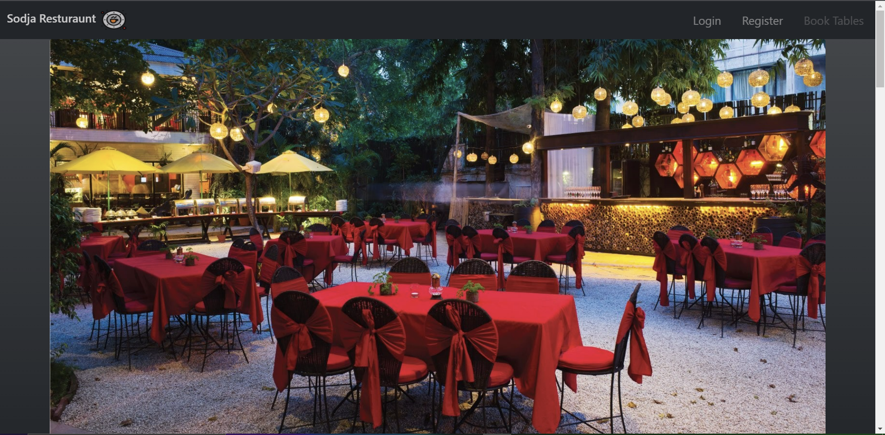
   + This is my home page, the first thing you will see when you load up my website.

## Preparation

* I have created User stories so that I could set specific goals for myself. I created some milestones so that I can better organize my time and focus my effort on a specific objective that I set for myself. I created sprints using the website 'ClickUp' so that I can easily check my progress on a specific user story. 

* Things that i did
   + User Stories
   + labels for those User Stories (To Better organize my priorities)
   + Milestones "iterations"
   + Sprints using the website "ClickUp"

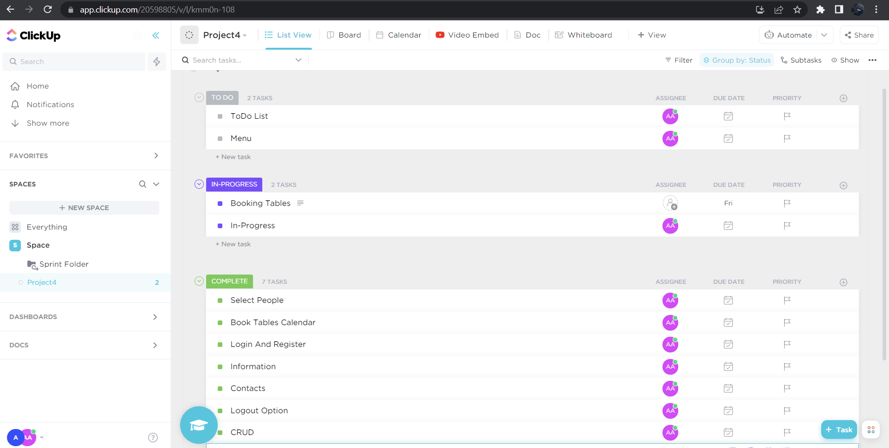
## Design process

* Before starting my project I thought about how I am going to structure and design my project. The first step I took was to create a diagram on my notes book (a basic sketch of what the website would look like) and I wrote some notes down on what I needed to add to my project so that I won't forget later. After I implemented a basic diagram sketch of my website I began creating a more detailed wireframe on the "InVision" website. Then I turned my basic notes into User stories and then created milestones and iterations with them.  

* I chose this color pattern of black and white with some red attributes because it's simplistic and easy to distinguish between the different sections and content using they's three colors. I also made sure the headings are in respectable sizes, comparing the sizes between the content and the headers. I tried to make it as easy as possible to read the content and headers to the user whilst keeping the theme.  

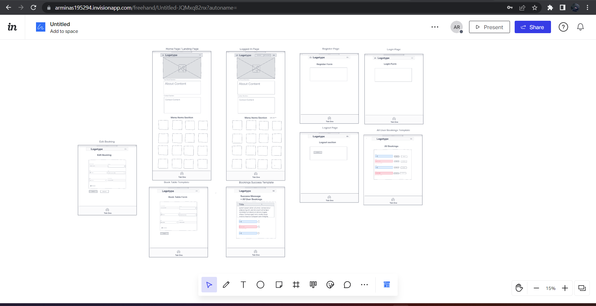
   + Wireframes

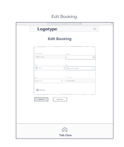
   + Edit Table Wireframe

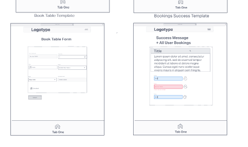
   + Book Table Wireframe

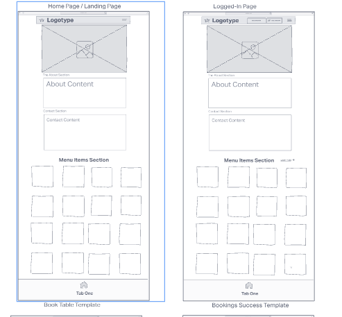
   + Home Page Wireframe

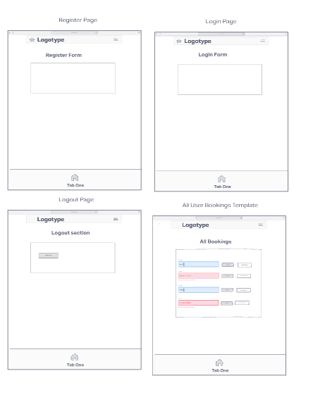
   + Wireframes

*** 

## Features of my Home Page

* Navigation menu
   + My navigation menu has 3 different pages labeled Login, Register, and Book-tables. 
   + My website is linear so that it's very easy to navigate through, the sections are clearly separated but not too far from each other, all my content is in a different color from the background so that it stands out. 
   + I have book-tables diabled for now because you need to be logged in to us that feature. 

***

* About-us section
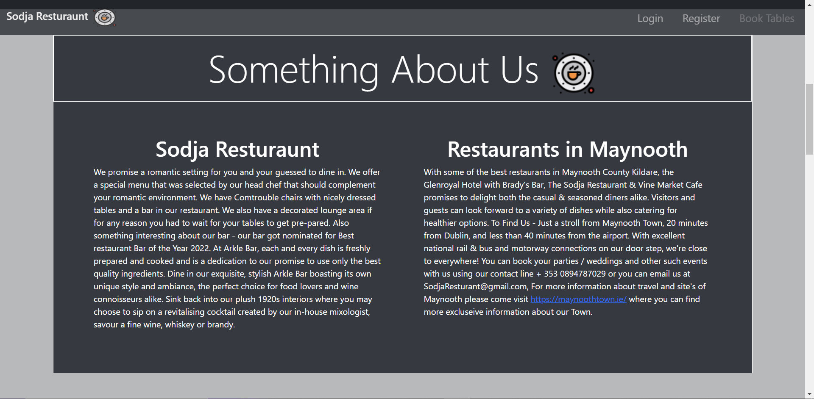
   + The about us section talks about the experience the user should expect once they enter sodja restaurant.
   + The about-us section also gives a tiny bit of contact information that the user can use.
   + The about-us section mentions the town of Maynooth where sodja restaurant is located, the section also provides a link to Maynooth's website where the user can find more information about the town. 

***

* Menu section
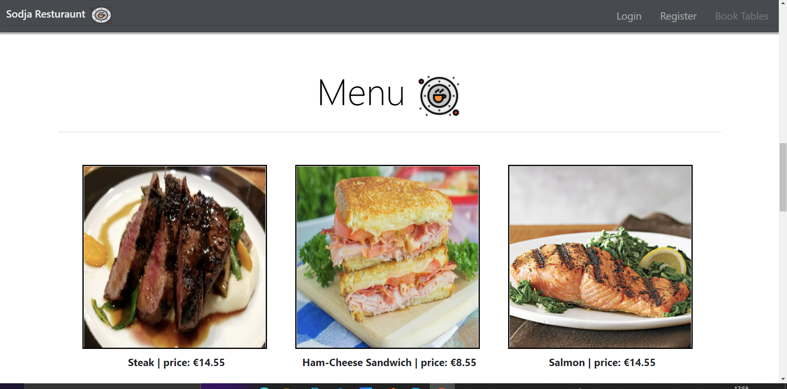
   + I created a menu section so that the user knows what is the restaurant's menu before entering the actual restaurant. 
   + On the menu, there is a price and name to all the meals displayed. 
***

* Footer
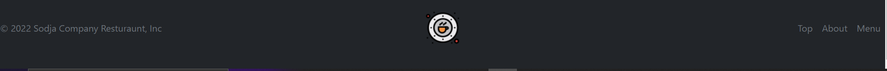
   + My footer has 3 links that the user can use.
   + The Top link brings the user to the top of the page.
   + The About link brings the user to the about section.
   + The Menu link brings the user to the menu section.

*** 

**Login page**
 * Login-page
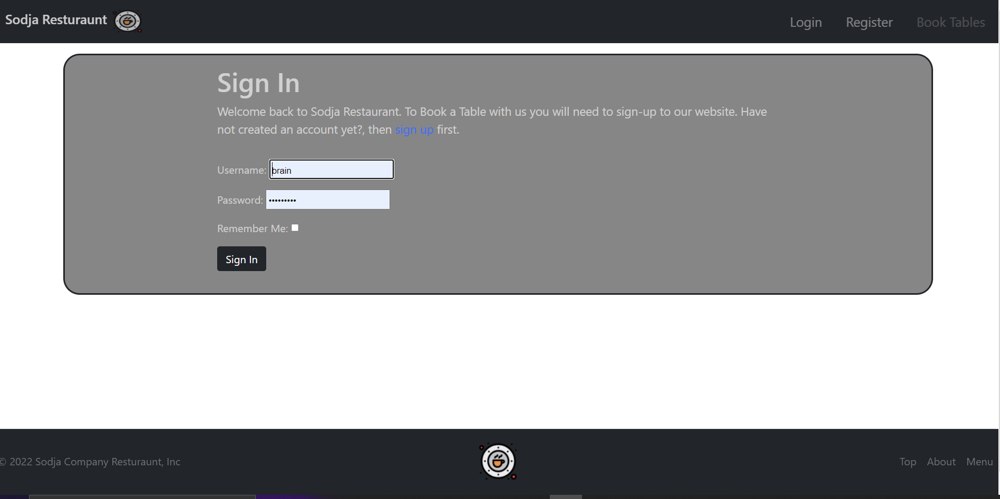
   + I implemented a login page because I wanted a system where the user has to sign-up first before using my book-tables feature.
   + The login page has a remember me feature and a link to the sign-up page in case you don't have an account yet.
   + the login page also has a place where the user writes their username and password to log in.  

*** 
**Sign-up**
 * Register page
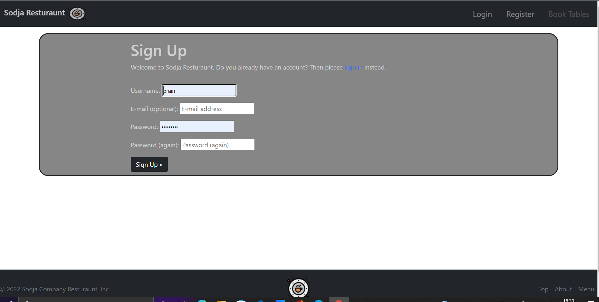
   + The Sign-up page has a username, email(optional), password, and password confirmation inputs that the user has to fill out before being able to sign-up.
   + The sign-up page has a link to the login page just in case the user already has an account. 

*** 
**Book-Table Page**
 * Book-Table Page
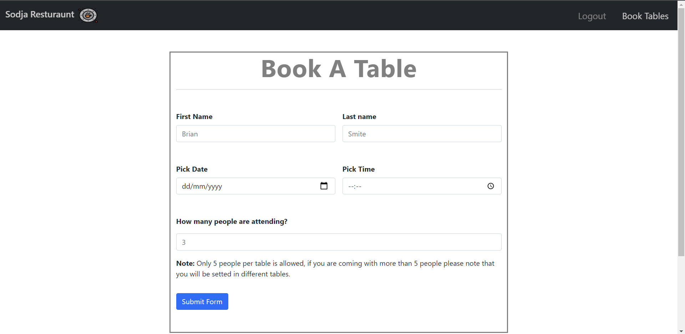
   + The user can only access this page if they are logged in.
   + The user has to fill in all the required boxes in order to book a table.
   + Once the user submits the form, a success message will appear to note that the booking was successful.  
   + The user will be able to cancelle their booking aswel once they have successfully booked a table. 
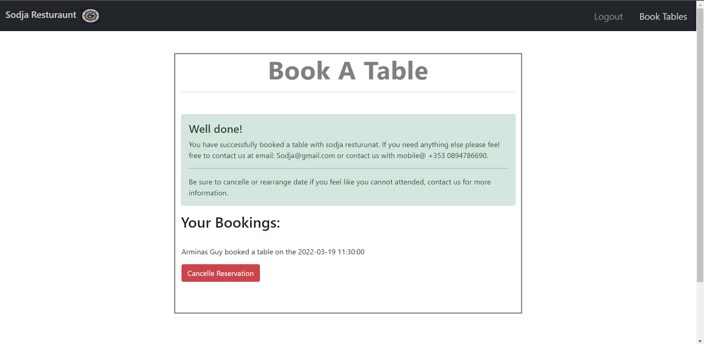

*** 
   ## Testing
   + I have tested the Booking form and I have confirmed that all the button and links work.
   + I have confirmed that all the icons and font work.
   + I have confirmed that all my content is easily readable to the user by showing my website to someone else.
   + I have tested my website in different browser's such as: Microsft Edge, Chrome, Firefox.
   + i wrote some test's that tests out the logic in my code using Unittest. 
   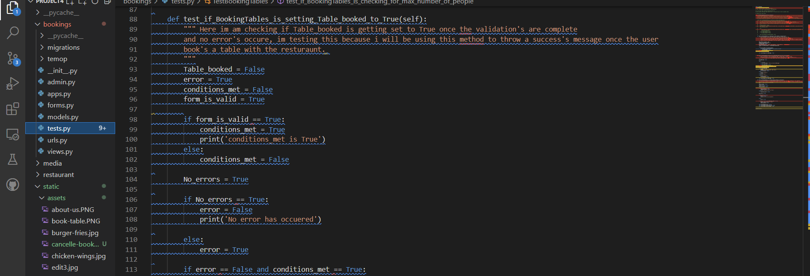

   **Bugs** 
* Solved Bugs
   + I had an issue with rendering the id of my bookings to the deleteBooking function but later i solved it by using the 'reverse' method. 
   + I had an issue with writting the logic out and using validations in the views.py file, it took me a long time to figure out that i can write
   validators in the forms.py file or even in the models file. 
   + At the start of my project i didnt fully understand the views in the views.py file, example: ListView, DetailView, DeleteView and so on...
   so i had a huge problem where i couldnt display my booking to the user so that they could delete it (or so i thought). This caused me to watch alot of videos and i wasted alot of time trying to figure out how can i fix my problem but i figured it out eventually.  
   
   **Unfixed Bugs** 
   + I can't import my models because i do not have an interpeter selected, i do not want to select it because it might break or undo something so im just leaving it be. 
   ***
**Validator Testing**
* HTML
   + I was using this validator to check for errors - https://validator.w3.org/.
   + To Check my html code i used "view page source" to get my html code without jinja and then copyed that code into the html validator. 
   
   + base.html passed with no errors. 
   + signup.html passed with no errors.
   + logout.html passed with no errors.
   + logged-in.html passed with no errors.
   + login.html Errors Found.
   + view-bookings.html Errors Found.
   + book-table.html Errors Found.
   + edit-booking.html Errors Found.
* CSS 
   + No errors were found.
* JavaScript
   + No code, No errors.
* Python
   + I used http://pep8online.com/ to check for erros, No erros occured except for 'line too long' and warnings for whitespace. Validated files: views.py, tests.py file. 
* Accessibility 
   + I have checked lighthouse and confirmed that my base.html page is easily accessible to users. score for Accessibility: 97.
   + I have checked lighthouse and confirmed that my login.html page is easily accessible to users. score for Accessibility: 97.
   + I have checked lighthouse and confirmed that my signup.html page is easily accessible to users. score for Accessibility: 97.
   + I have checked lighthouse and confirmed that my logout.html page is easily accessible to users. score for Accessibility: 97.
   + I have checked lighthouse and confirmed that my logged-in.html page is easily accessible to users. score for Accessibility: 97.
   + I have checked lighthouse and confirmed that my view-bookings.html page is easily accessible to users. score for Accessibility: 96.
   + I have checked lighthouse and confirmed that my edit-bookings.html page is easily accessible to users. score for Accessibility: 97.
   + I have checked lighthouse and confirmed that my book-table.html page is easily accessible to users. score for Accessibility: 97.

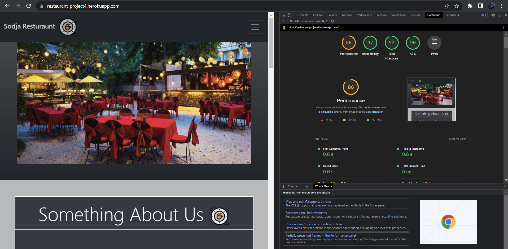
*** 
   ## Development
* My website was deployed on GitHub pages.
   + https://github.com/Arminas19/project4
* My webiste was deployed to Heroku.
   + https://restaurant-project4.herokuapp.com/

## Deployment
* First step i took for deployment was to turn DEBUG = True to DEBUG = False.
   + This step ensures me that the debug tool is off so that no sensitive information gets leaked.
* I also added "ACCOUNT_EMAIL_VERIFICATION = 'none'" into my settings.py.
   + I added this code in because when i didnt have this i was thrown a 500 server error in Heroku.
* I also change some config vars in the Heroku app in the settings section.
   + I deleted DISABLE_COLLECTSTATIC from the heroku config vars.
* I added X_FRAME_OPTIONS = 'SAMEORIGIN' 
   + I had to add X_FRAME_OPTIONS because without that the summernote extension will not work on the deployed heroku app.

### Credits 
**Content** 
   + I got inspiration from code institute's "i think before i blog" section. 
   + I had looked over Django documentation and stackoverflow to check the syntax that I didn't know how to use.
   + Got help solving some bugs from tutor's and my mentor.
   
**Media**
   + I copy and pasted a small fraction of text from Glenroyal restaurant into my Sodja restaurant project.
   + All my images were taken from google images.  
   + I got my icon image from google.

## Resolution Sizes
   + Fully responsive sizes.

