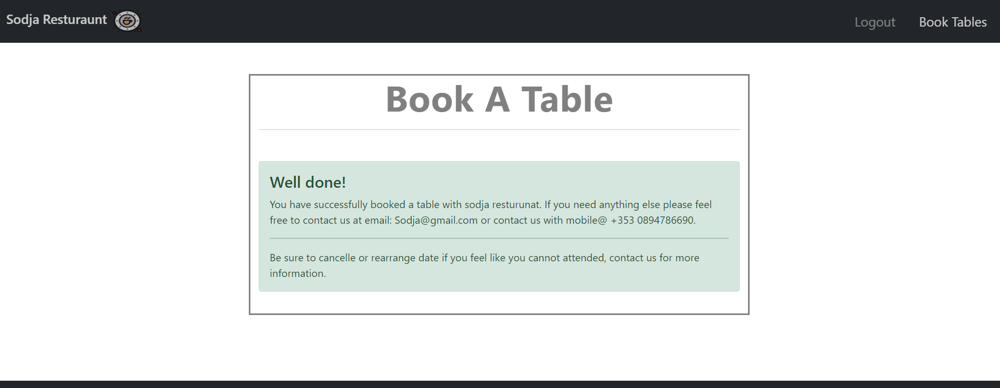

# Sodja Restaurant

* Introduction
   + I created a website that advertised sodja restaurant and the website also has a book tables feature that a logged-in user can use.
   + My website has a login and a register feature, there is also a sign-out feature that a logged-in user can use.

   + This is my home page, the first thing you will see when you load up my website.

## Features of my Home Page

* Navigation menu
   + My navigation menu has 3 different pages labeled Login, Register, and Book-tables. 
   + My website is linear so that it's very easy to navigate through, the sections are clearly separated but not too far from each other, all my content is in a different color from the background so that it stands out. 
   + I have book-tables diabled for now because you need to be logged in to us that feature. 

***

* About-us section

   + The about us section talks about the experience the user should expect once they enter sodja restaurant.
   + The about-us section also gives a tiny bit of contact information that the user can use.
   + The about-us section mentions the town of Maynooth where sodja restaurant is located, the section also provides a link to Maynooth's website where the user can find more information about the town. 

***

* Menu section

   + I created a menu section so that the user knows what is the restaurant's menu before entering the actual restaurant. 
   + On the menu, there is a price and name to all the meals displayed. 
***

* Footer

   + My footer has 3 links that the user can use.
   + The Top link brings the user to the top of the page.
   + The About link brings the user to the about section.
   + The Menu link brings the user to the menu section.

*** 

**Login page**
 * Login-page

   + I implemented a login page because I wanted a system where the user has to sign-up first before using my book-tables feature.
   + The login page has a remember me feature and a link to the sign-up page in case you don't have an account yet.
   + the login page also has a place where the user writes their username and password to log in.  

*** 
**Sign-up**
 * Register page

   + The Sign-up page has a username, email(optional), password, and password confirmation inputs that the user has to fill out before being able to sign-up.
   + The sign-up page has a link to the login page just in case the user already has an account. 

*** 
**Book-Table Page**
 * Book-Table Page

   + The user can only access this page if they are logged in.
   + The user has to fill in all the required boxes in order to book a table.
   + Once the user submits the form, a success message will appear to note that the booking was successful.  

*** 
   ## Testing
   + I have tested the sign-up form and I have confirmed that the button and link work, you need an email for the email input and all inputs are set to require. 
   + I have confirmed that all the icons and font work.
   + I have confirmed that all my content is easily readable to the user by showing my website to someone else.
   + I have confirmed that my video is fully controllable and that it fully works like it's supposed to.
   + I have tested my website in different browser's such as: Microsft Edge, Chrome, Firefox.
   **Bugs** 
* Solved Bugs
   + I had an issue with adding the FIFA video to my website, later I found out with some help from code institute's Tutor assistance that it was my link and I didn't embed it before adding it to my code. 
   + I had an issue with the display: inline; it wouldn't work properly but I figured it out and margined the home content till it was level.
   
   **Unfixed Bugs** 
   + I can't move my iframe video to the left, I tried margin, padding, and floats but the only thing that worked was a one line style but the problem is that I cant use @media on it to set height and width, just couldn't connect my CSS to this element. 
   + If I had more time I would try and make this website a bit more responsive. 
   ***
**Validator Testing**
* HTML
   + No errors or warnings were found for all pages - index More or sign-up.
* CSS 
   + No errors were found but a warning with the contents of 'Imported style sheets are not checked indirect input and file upload modes' which doesn't relate to my CSS.
* Python
   + 
* Accessibility 
   + I have checked lighthouse and confirmed that my website is easily accessible to users.
   
*** 
   ## Development
* My website was deployed on GitHub pages, they are the steps I took:
   + In GitHub repository, I navigated to settings. 
   + I scrolled down to pages, I clicked on the link. 
   + In the source drop-down menu, I selected my branch as - main, and then I got the link to my website. 
   * Here is the link to my website - https://arminas19.github.io/Project1/ 
 ### Credits 
**Content** 
   + I got inspiration from code institute's "i think before i blog" section. 
   + I had looked over Django documentation and stack overflow to check for syntax that I didn't know how to use.
   
**Media**
   + I copy and pasted a small fraction of text from Glenroyal restaurant into my Sodja restaurant project.
   + All my images were taken from google images.  
   + I got my icon image in google.
## Resolution Sizes
   + Fully responsive sizes.

